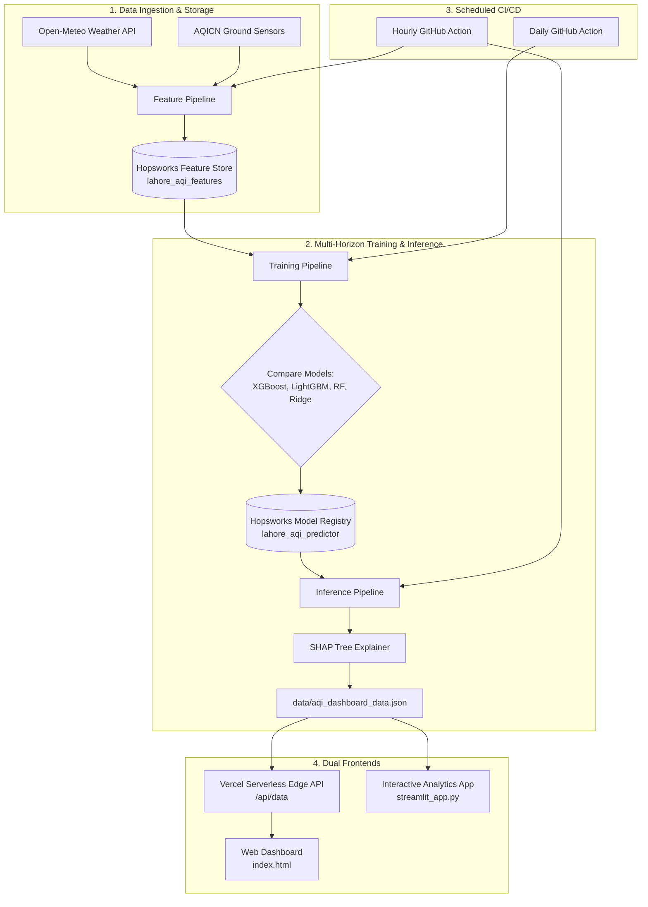

# 🌫️ Pearls AQI Predictor

> **Production-grade AI Air Quality Forecasting System for Lahore, Punjab, Pakistan**  
> 3-Day (72-Hour) Multi-Horizon AQI & $PM_{2.5}$ predictions powered by Machine Learning, Hopsworks Feature Store, Automated GitHub Actions, and high-performance Web & Streamlit Dashboards.

[](https://pearls-aqi-predictor-9j4b.vercel.app)
[](https://python.org)
[](https://hopsworks.ai)
[](https://opensource.org/licenses/MIT)

---

## 🌐 Live Dashboards

* ⚡ **Production Web Dashboard:** [https://pearls-aqi-predictor-9j4b.vercel.app](https://pearls-aqi-predictor-9j4b.vercel.app)
* 📊 **Local Streamlit Dashboard:** `http://localhost:8501` (Run via `streamlit run app/streamlit_app.py`)
* 🔌 **REST API Endpoint:** `https://pearls-aqi-predictor-9j4b.vercel.app/api/data`

---

## 🌟 Key Features

* **Multi-Horizon ML Architecture:** Separate winning models trained specifically for each forecast horizon:
  * **Day 1 (24 Hours)** — Real-time short-range forecast.
  * **Day 2 (48 Hours)** — Mid-range atmospheric projection.
  * **Day 3 (72 Hours)** — Extended 3-day trend forecasting.
* **US EPA Standard Compliance:** Conversion between AQI and $PM_{2.5}$ / $PM_{10}$ using standard piecewise linear EPA breakpoint formulas.
* **Explainable AI (SHAP):** Transparent feature attribution displaying top positive/negative atmospheric drivers for every prediction horizon.
* **Fully Serverless Ingestion & Training:**
  * **Hourly GitHub Actions:** Ingests live weather & pollutant readings into the Hopsworks Feature Store and regenerates real-time predictions.
  * **Daily GitHub Actions:** Evaluates competing algorithms (XGBoost, LightGBM, Random Forest, Ridge), tracks model drift, and updates the Hopsworks Model Registry.
* **Dual Modern Frontends:**
  * **Web Dashboard (`index.html` / `frontend.html`):** Dark-mode UI with SVG animated gauge, 24-hour observed trends, and 72-hour forecast charts.
  * **Streamlit Analytics App (`app/streamlit_app.py`):** Interactive exploration UI with Plotly spline curves, pollutant dials, and SHAP horizon tabs.

---

## 🏗️ System Architecture



---

## 📁 Repository Structure

```
Pearls-AQI-Predictor/
│
├── 📂 .github/workflows/
│   ├── feature_pipeline.yml     ← Hourly workflow: fetches data, uploads to Hopsworks & runs inference
│   └── training_pipeline.yml    ← Daily workflow: retrains models & updates Model Registry
│
├── 📂 app/
│   ├── frontend.html            ← Full standalone web dashboard (Chart.js + SVG Gauge)
│   ├── flask_api.py             ← Local REST API backend (serves /api/data)
│   └── streamlit_app.py         ← Interactive Streamlit dark-mode analytics dashboard
│
├── 📂 data/
│   ├── aqi_dashboard_data.json  ← Single source of truth payload feeding both frontends
│   ├── lahore_aqi_historical_2024_onwards.csv ← Active historical dataset (2024–present)
│   └── lahore_aqi_3day_forecast.csv ← 72-hour predicted forecast export
│
├── 📂 models/
│   ├── best_model_day1.pkl      ← Trained winner model for Day 1 (24h horizon)
│   ├── best_model_day2.pkl      ← Trained winner model for Day 2 (48h horizon)
│   ├── best_model_day3.pkl      ← Trained winner model for Day 3 (72h horizon)
│   ├── scaler_day1.pkl / day2 / day3 ← Fitted StandardScalers per horizon
│   ├── shap_importance.json     ← SHAP importance values per feature
│   └── training_results.json    ← Benchmark metrics (RMSE, MAE, R²)
│
├── 📂 pipelines/
│   ├── feature_pipeline.py      ← CLI entrypoint for hourly data ingestion
│   ├── inference_pipeline.py    ← CLI entrypoint to generate aqi_dashboard_data.json
│   └── training_pipeline.py     ← CLI entrypoint for multi-horizon model retraining
│
├── 📂 requirements/
│   ├── requirements.txt         ← Complete ML dependencies (Hopsworks, XGBoost, SHAP)
│   └── project_requirements.md  ← Project engineering specifications
│
├── 📂 src/
│   ├── alerts.py                ← Hazardous AQI threshold logic
│   ├── config.py                ← Central configurations, paths, coordinates & features
│   ├── features/
│   │   ├── engineering.py       ← Time lags, rolling stats & EPA aqi_to_pm25 conversions
│   │   ├── fetch_raw.py         ← Open-Meteo & AQICN API fetchers
│   │   └── pipeline.py          ← Hopsworks Feature Store upload logic
│   ├── inference/
│   │   ├── pipeline.py          ← Inference orchestration & JSON generator
│   │   └── predict.py           ← Multi-horizon prediction & SHAP explanation engine
│   └── training/
│       └── train.py             ← Multi-model evaluation & Hopsworks registry upload
│
├── 📂 tests/
│   └── test_hopsworks_upload.py ← Integration test suite
│
├── 📂 archive/                  ← 🗄️ Preserved scratch scripts & exploration notebooks
│
├── .env.example                 ← Environment variable template
├── .gitignore                   ← Git ignore rules
├── .vercelignore                ← Excludes heavy ML folders from Vercel deployments
├── index.html                   ← Root entrypoint for static hosting
├── index.py                     ← Lightweight Flask router for Vercel (< 15 MB)
├── pyproject.toml               ← Standard package metadata & Vercel entrypoint config
├── README.md                    ← Complete project documentation
├── requirements.txt             ← Lightweight web dependencies for Vercel
└── vercel.json                  ← Vercel deployment configuration
```

---

## 🚀 Quick Start & Local Setup

### 1. Clone the Repository
```bash
git clone https://github.com/ranazain9/Pearls-AQI-Predictor.git
cd Pearls-AQI-Predictor
```

### 2. Set Up Virtual Environment & Dependencies
```bash
# Create and activate virtual environment
python -m venv .venv
source .venv/bin/activate  # On Windows: .venv\Scripts\activate

# Install full ML dependencies
pip install -r requirements/requirements.txt
```

### 3. Configure Environment Variables
Copy `.env.example` to `.env` and fill in your API keys:
```bash
cp .env.example .env
```

```ini
HOPSWORKS_API_KEY=your_hopsworks_api_key_here
HOPSWORKS_PROJECT_NAME=your_project_name
AQICN_API_TOKEN=your_aqicn_token_here       # Optional
OPEN_WEATHER_API=your_openweather_key_here  # Optional
```

---

## 💻 Running the Applications

### Option A: Launch Streamlit Analytics Dashboard
```bash
streamlit run app/streamlit_app.py
```
Open **`http://localhost:8501`** in your browser.

### Option B: Launch Local Flask REST API & Web Dashboard
```bash
python app/flask_api.py
```
Open **`http://127.0.0.1:5000`** in your browser.

---

## 🔄 Running the ML Pipelines Locally

```bash
# 1. Ingest live hourly weather and upload to Hopsworks Feature Store
python pipelines/feature_pipeline.py --upload

# 2. Retrain all multi-horizon models and evaluate winner algorithms
python pipelines/training_pipeline.py --register

# 3. Generate fresh 72-hour predictions & update data/aqi_dashboard_data.json
python pipelines/inference_pipeline.py
```

---

## 🧪 Benchmark Performance

| Horizon | Winning Algorithm | Test RMSE (AQI) | Test $R^2$ Score |
|---|---|---|---|
| **Day 1 (24h)** | **XGBoost Regressor** | **±19.0** | **0.84** |
| **Day 2 (48h)** | **XGBoost Regressor** | **±23.1** | **0.78** |
| **Day 3 (72h)** | **XGBoost Regressor** | **±23.9** | **0.75** |

---

## ☁️ Deployment Guide (Vercel)

The web dashboard is configured to deploy as a lightweight serverless application:

```bash
# Deploy to production
npx vercel --prod
```

* **Zero-ML Web Bundle:** Root [`requirements.txt`](file:///d:/Pearls-AQI-Predictor/requirements.txt) only includes Flask and Gunicorn (**< 15 MB**), eliminating Vercel's 500 MB serverless function limit.
* **Edge Routing:** [`vercel.json`](file:///d:/Pearls-AQI-Predictor/vercel.json) and [`pyproject.toml`](file:///d:/Pearls-AQI-Predictor/pyproject.toml) route `/` and `/api/data` with global sub-50ms latency.

---

## 📜 License

This project is licensed under the MIT License — see the [LICENSE](LICENSE) file for details.
